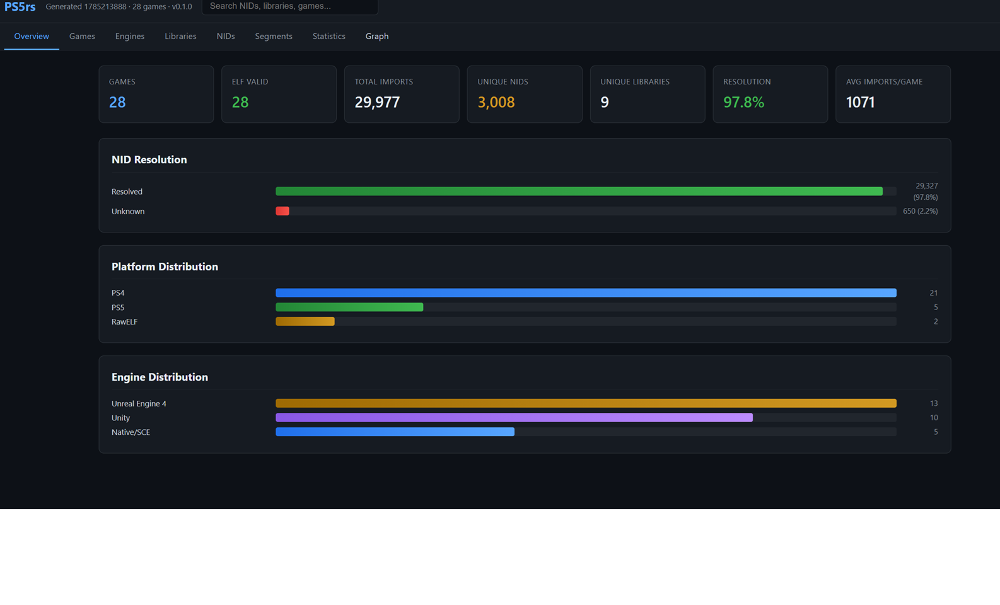
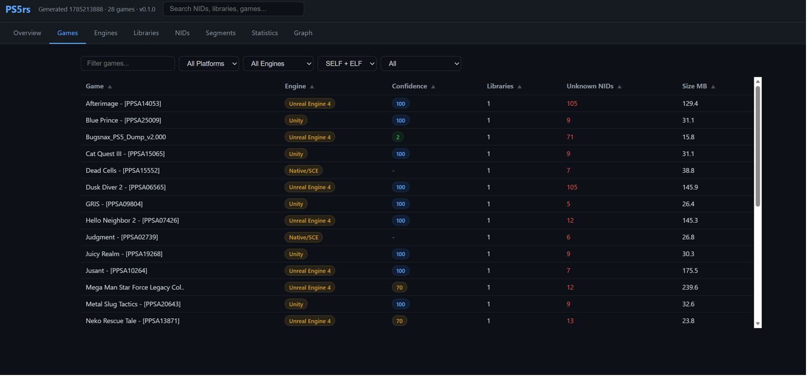
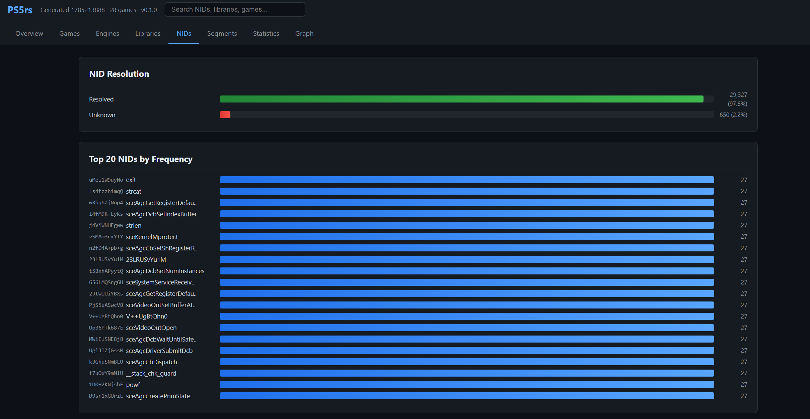
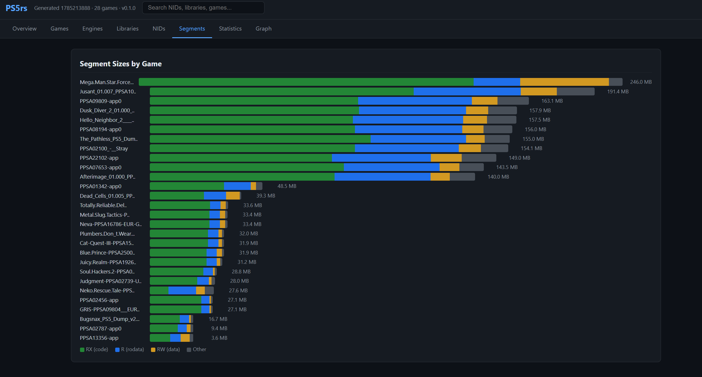
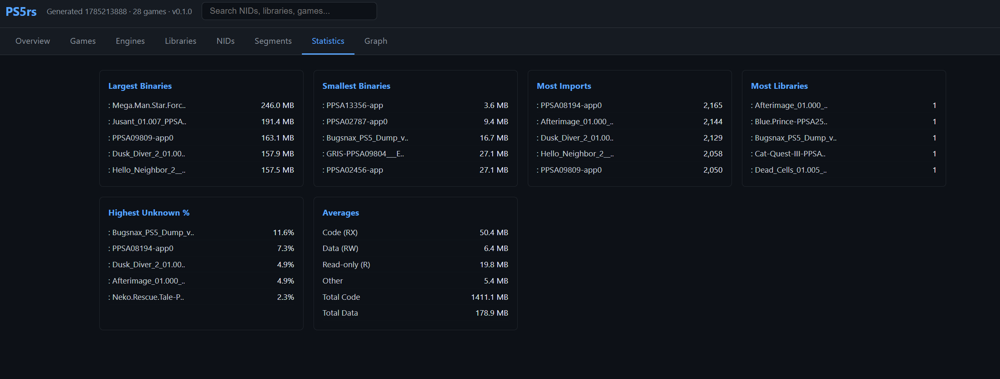

# ps5rs

A PS5 binary analysis, virtual loading, and host-side emulation framework written in Rust.

Parses SELF/ELF/PRX formats, resolves NID imports, extracts clean ELFs, fingerprints game binaries through string analysis (engine/middleware/SDK detection), and generates interactive dashboards.

Also provides a virtual PS5 loader: maps ELF memory, applies relocations (RELATIVE, ABS64, GLOB_DAT, JUMP_SLOT), resolves imports against runtime PRX exports and offline system-module databases, and stubs unknown symbols for multi-module dependency analysis.

A host-side emulator (`ps5-emu`) executes guest binaries on the host CPU and routes system-library imports through pure-Rust HLE modules.

## Why Rust?

The PS5 uses an x86-64 AMD Zen 2 CPU, which means CPU instruction compatibility is not the primary challenge. The main difficulties are the PS5 ABI, system libraries, graphics stack, kernel interfaces, and runtime services. Rust eliminates an entire class of memory safety bugs (buffer overflows, use-after-free, data races, null pointer dereferences) that plague unsafe native code, while matching C++ performance. For a project that parses untrusted binary data from third-party game dumps, this safety guarantee is critical.

## Crates

| Crate | Purpose |
|---|---|
| `ps5-format` | Shared types, error enums, ELF/SELF constants, SHA-256 utility |
| `ps5-self` | SELF container parsing (PS4/PS5 wrappers around ELF) |
| `ps5-elf` | ELF64 binary format parsing (headers, segments, symbols, relocations) |
| `ps5-nid` | NID hash algorithm (SHA1 + Sony custom base64), name catalog (v2 with merge semantics), resolver |
| `ps5-image` | BinaryImage IR: normalized abstraction with JSON serialization, `Detection` with confidence/evidence |
| `ps5-analysis` | Analysis engine: scanner, dataset, PRX module discovery, dependency analysis, string fingerprinting, engine detection, third-party middleware classification, reports, and export |
| `ps5-loader` | PS5 ELF/PRX loader: virtual memory model, relocation engine (RELATIVE, ABS64, GLOB_DAT, JUMP_SLOT), import resolver with 3-tier lookup (runtime exports → offline exports → stub allocator), NID computation, multi-module dependency loading |
| `ps5-emu` | Host-side emulator: loads binaries through the loader pipeline, executes guest entry points as native x86-64, routes system-library imports through HLE modules, emits `ExecutionReport` |
| `ps5-tests` | Deterministic, self-authored ELF fixture generator + manifest of expected guest behavior (regression suite input) |
| `ps5-dashboard` | Static HTML dashboard generator (self-contained, no CDN dependencies) |
| `ps5-cli` | Command-line interface |

## Building

```sh
cargo build --release
```

MSRV: Rust 1.85 (edition 2024).

## Quick Start

The full analysis pipeline — scan game dumps, extract clean ELFs, analyze engines, and generate a dashboard:

```sh
# 1a. Scan eboot.bin only
ps5rs scan ./games --output analysis/

# 1b. Scan eboot.bin + sce_module/*.prx modules
ps5rs scan ./games --output analysis/ --include-modules

# 2. Extract clean ELFs from SELF containers
ps5rs batch-extract ./games --output analysis/

# 3. Validate dataset (SHA256 cross-reference)
ps5rs validate analysis/

# 4. Run analysis reports
ps5rs analyze stats analysis/
ps5rs analyze imports analysis/
ps5rs analyze engines analysis/

# 5. Generate interactive dashboard
ps5rs dashboard analysis/

# 5b. Include third-party middleware detection (scans the games folder)
ps5rs dashboard analysis/ --games ./games

# 6. Boot a binary in the host-side emulator
ps5rs run path/to/eboot.elf

# 7. Generate the emulator's test fixture ELF files yourself
cargo run -p ps5-tests --bin generate
```

## Usage

### Scan a game directory (creates dataset)

The primary workflow: scan game binaries once, then run any number of reports instantly without re-parsing.

```sh
ps5rs scan ./games --output analysis/

# Include PRX system modules alongside eboot.bin
ps5rs scan ./games --output analysis/ --include-modules

# Load external NID catalogs for higher resolution
ps5rs scan ./games --output analysis/ --nids extra_nids.csv
```

Each game's `eboot.bin` is parsed into a `BinaryImage` and serialized as an individual JSON file. When module scanning is enabled, PRX/SPRX files from `sce_module/` are stored as individual `BinaryImage` documents linked back to their parent game.

Each binary component is analyzed independently — eboot, PRX modules, and extracted SELF images each retain their own imports, NIDs, strings, library versions, and detection evidence.

```
analysis/
  manifest.json       # schema v6: tool, timestamp, image count, module count, game metadata
  images/
    GameTitle/
      eboot.json            # eboot.bin analysis
      libScePad.prx.json    # PRX module analysis
      libSceVideoOut.prx.json
```

### Extract clean ELFs from SELF containers

Sony's SELF format wraps ELF code segments with encryption and metadata. The `extract` commands produce clean, standard ELF files that tools like `readelf` can analyze.

```sh
# Extract a single binary
ps5rs extract path/to/eboot.bin -o output.elf

# Batch extract all games
ps5rs batch-extract ./games --output analysis/
```

### Analyze a dataset

All `analyze` subcommands read from a dataset directory (no binary parsing). If a dataset doesn't exist, they fall back to scanning from raw binaries.

```sh
# Statistics (total imports, resolution rate, most common NID)
ps5rs analyze stats analysis/

# Import inventory: which libraries are used by how many games
ps5rs analyze imports analysis/

# Engine detection (Unity/Unreal/Godot/native with confidence scores)
ps5rs analyze engines analysis/

# Library x game heatmap
ps5rs analyze heatmap analysis/

# NID frequency ranking (top 50)
ps5rs analyze frequency analysis/

# Unresolved NIDs (per game)
ps5rs analyze unresolved analysis/

# Dependency graph (Graphviz DOT or JSON)
ps5rs analyze graph analysis/ -o graph.dot
ps5rs analyze graph analysis/ --include-nids --format json -o graph.json

# Library versions across games
ps5rs analyze library-versions analysis/

# Validation (SHA256 cross-reference)
ps5rs validate analysis/
```

All report commands accept `--format` (terminal/csv/json/dot) and `-o` (output file).

### Export unknown NIDs

Export unresolved NID hashes as CSV for catalog growth. Each row shows the library, NID hash, occurrence count, and semicolon-separated list of games.

```sh
# Group by frequency (default)
ps5rs export-unknown analysis/ -o unknown_nids.csv

# Group by library
ps5rs export-unknown analysis/ --group-by library -o unknown_by_lib.csv
```

### List exports from a PRX module

List all exported symbols from a PRX module with NID, name, address, and size. Supports substring search and JSON output for building firmware export databases.

```sh
# Full export table
ps5rs exports libc.prx

# Search for specific symbols
ps5rs exports libc.prx --search malloc

# JSON output (for offline export database)
ps5rs exports libc.prx --json --output libc.exports.json
```

Offline export files are loaded automatically from `./system_modules/` to resolve imports from system PRXes that aren't available at analysis time (e.g., libkernel.prx, libSceLibcInternal.prx).

### Detect third-party middleware

Scan a games directory and classify every PRX module by vendor and product. Modules are bucketed into third-party, Sony system, and unidentified; each is parsed for import/export counts and library names.

```sh
# Terminal report (default)
ps5rs middleware ./games

# JSON report (machine-readable)
ps5rs middleware ./games --format json -o middleware.json
```

The built-in fingerprint catalog covers audio engines (FMOD, Wwise, Resonance Audio, Auro-3D, iZotope, McDSP, CRIWARE), UI frameworks (Coherent Gameface, WebKit), Unity runtime modules (IL2CPP, Burst, PS5 platform, PSN, Save Data), and networking SDKs (Epic Online Services), among others.

### Community NID Catalog

ps5rs can synchronize with the community NID catalog hosted on Supabase to resolve more NID hashes and contribute unknown ones back.

Download the latest catalog (works immediately — ships with the community key for read-only access):

```sh
ps5rs catalog sync
```

Upload unknown NIDs for community review (requires an explicit key — writes are sensitive):

```sh
ps5rs catalog push-unknown -i unknown.csv --key sb_publishable_xxxxx
```

With GitHub username (local format validation + optional API existence check):

```sh
ps5rs catalog push-unknown -i unknown.csv -s claimore22 --key sb_publishable_xxxxx
```

Key resolution order: `--key` flag → `PS5RS_SUPABASE_KEY` environment variable → `~/.config/ps5rs/config.toml` (file) → built-in default (sync only, never for push-unknown). This means sync works out of the box, while push-unknown always requires explicit configuration via one of the first three methods.

Persistent setup (skip `--key` every time):

```sh
mkdir -p ~/.config/ps5rs
cat >> ~/.config/ps5rs/config.toml << 'EOF'
[catalog]
supabase_key = "sb_publishable_xxxxx"
EOF
```

The sync command maintains a SHA-256 cache to skip re-downloading unchanged catalogs. The push command deduplicates by (NID, library), stamps each submission with `submitter`, `submitter_type` ("github" | "anonymous"), and `github_verified` metadata, and never blocks on GitHub API failures.

### Inspect a binary

```sh
ps5rs inspect path/to/eboot.bin
```

Shows platform, SELF segments, ELF header fields, and a summary of imports by library + resolved name.

### List imports

```sh
ps5rs imports path/to/eboot.bin
```

Lists all NID imports with resolved function names and source libraries.

### String extraction and fingerprinting

Extract printable strings from any binary (encrypted eboots, extracted ELFs, PRX modules) and optionally run engine/middleware detection:

```sh
# Basic string extraction (minimum 4 characters)
ps5rs strings path/to/eboot.bin

# With offset tracking
ps5rs strings path/to/eboot.bin --offsets

# With engine/middleware detection
ps5rs strings path/to/eboot.bin --detect

# Custom minimum length, output to file
ps5rs strings path/to/eboot.bin -n 8 -o strings.txt
```

The `--detect` flag prints a structured summary including detected engine, SCE libraries, third-party middleware, build system, SDK hints, source depot paths, and custom engine forks.

### Hash a function name to NID

```sh
ps5rs nid sceKernelLoadStartModule
# -> 4ZjF4RQH3k8
```

## Binary Dependency Intelligence

ps5rs does not treat a game as a single executable. A PS5 title is analyzed as a collection:

```
Game
 |
 +-- eboot.bin
 |
 +-- sce_module/
       +-- libGame.prx
       +-- libSceVideoOut.prx
       +-- libSceGnmDriver.prx
```

Each dependency records:

- Imported libraries and resolved NIDs
- SDK version identifiers
- Engine and middleware fingerprints
- String evidence and source paths

This allows answering questions like:

- Which games use `libSceGnmDriver`?
- Which modules require a specific SDK version?
- Which binaries contain Unreal Engine runtime code?

## Architecture Overview

```
                         PS5 binaries
                              |
              +---------------+---------------+
              |                               |
          eboot.bin                    sce_module/*
        (SELF or ELF)                 (*.prx/*.sprx)
              |                               |
              +---------------+---------------+
                              |
                 +------------+------------+
                 |                         |
             ps5-self                  ps5-elf
        (SELF → clean ELF)        (ELF parsing)
                 |                         |
                 +------------+------------+
                              |
                         ps5-image
                    (BinaryImage IR)
                              |
          +-------------------+-------------------+
          |                                       |
       scan /                               extract /
    batch-extract                         batch-extract
          |                                       |
  AnalysisDataset                         Extracted ELFs
          |
  +-------+------------------------------------------------+
  |                |                 |                      |
stats          imports          heatmap              dashboard
  |
  +----------------------+-------------------------------+
                         |
                 Binary intelligence
                         |
        +----------------+----------------+
        |                                 |
 string analysis                 ELF/SELF analysis
        |                                 |
 +------+-------+                 +-------+--------+
 |              |                 |                |
Engine       Middleware       NID resolution   Libraries
fingerprints detections       imports          versions
 |              |                 |                |
UE4/UE5       PhysX/Bink       Functions       libSce*
Unity         FMOD             aliases        SDK versions
Godot         OpenSSL          metadata
 |
confidence + evidence
```

Each executable component (eboot, PRX, SPRX) becomes an independent `BinaryImageDocument` while preserving relationships between modules and their parent game. The `BinaryImage` IR decouples raw parsers from consumers. The `scan` command produces a dataset of `BinaryImageDocument` JSON files for eboot binaries and their accompanying PRX/SPRX modules. String analysis runs on raw bytes during scanning — no cloning of hundred-MB binaries. All `analyze` reports and the `dashboard` command consume the dataset without touching raw binaries, making iteration fast and portable.

## String-Based Fingerprinting

During scanning, `ps5-analysis` extracts printable strings from raw binary bytes and runs a series of detectors:

| Detector | What it finds |
|---|---|
| `detect_engine()` | UE4/UE5/Unity/Godot via weighted pattern scoring |
| `detect_third_party()` | PhysX, Bink, FMOD, Wwise, Coherent Gameface, ICU, libpng, OpenSSL, etc. |
| `detect_build_system()` | Jenkins, build server paths |
| `detect_depot()` | Source depot paths (`U:/P4Damascus/...`) |
| `detect_custom_forks()` | P4Damascus, HK_Project_Delivery, HK_EngineSources |
| `detect_sdk_hints()` | Possible SDK references Hints|
| `detect_versions()` | Library version strings (PhysX 3.4, libpng 1.5.2, etc.) |
| `detect_source_paths()` | Embedded source file paths |

Library detection combines multiple evidence sources:

| Source | Example |
|---|---|
| ELF dynamic imports | `libScePad` |
| PRX module imports | `libSceVideoOut` |
| SELF metadata | module dependencies |
| String extraction | embedded library paths |

Each detection retains provenance and confidence information.

Engine detection uses weighted fingerprints. Each pattern contributes a score, and the engine with the highest total wins. Ties prefer the newer engine version.

```
UnrealEngine4Runtime    +100
FShaderPipelineCache    +80
UObject                 +50
FName                   +50
                        ----
Total: 280  →  UE4 (confidence: 100%)
```

## NID Database

The CLI ships with an embedded NID catalog (`data/nids.csv`) containing ~154K hash-to-name mappings. The catalog uses merge semantics — loading multiple files combines entries rather than overwriting. A community-maintained Supabase catalog provides additional coverage; see [Community NID Catalog](#community-nid-catalog).

```sh
# Load additional community NID files
ps5rs scan ./games --output analysis/ --nids community_nids.csv --nids more_nids.csv
```

Catalog format supports two modes:
- **Legacy** (space-separated): `NID name`
- **Rich CSV** (comma-separated): `nid,name,library,tag,source`

Rich CSV files auto-detect header rows and merge library/tag/source metadata per NID.

Future catalog expansion may include richer relationships such as multiple aliases per NID, library associations, tags, source references, and usage statistics.

## Dashboard

The `ps5-dashboard` crate generates a self-contained HTML file with all data embedded as a JSON blob. No CDN, no external dependencies — fully offline.

- Dark theme, responsive layout
- Sortable tables with filtering
- Log-scaled heatmap (handles skewed import counts: 12K libkernel vs 40 libSceAudio3d)
- CSS-only charts (conic-gradient pie, stacked bars, horizontal bar charts)
- Vanilla JS for interactivity (no frameworks)
- Module-aware game views with per-module import/SDK breakdown
- SDK library version tracking across the dataset
- Binary dependency exploration
- Third-party middleware inventory per game (vendor/product attribution, import counts)
- Load Coverage analytics (resolution/stub rates, unavailable modules)








Tabs: Overview, Games, Engines, Libraries, NIDs, Segments, Statistics, Graph, Load Coverage, Middleware

## Compatibility Research

ps5rs is intentionally focused on binary understanding and host-side
execution rather than full compatibility. The extracted information and the
`ps5-emu` HLE layer (which already implements `libc`, `libkernel`, and
`libSceDbg` host modules) provide the foundation for future compatibility
work:

```
Binary analysis
        |
        v
Dependency graph
        |
        v
Required system APIs
        |
        v
HLE implementations
        |
        v
Compatibility runtime
```

## Test Suite

525+ tests across 11 crates covering ELF parsing, SELF extraction, NID hashing/caching, BinaryImage IR, string fingerprinting, engine detection, analysis reports, dataset operations, batch extraction, dashboard generation, PRX module scanning, PS5 ELF/PRX loading with relocation and import resolution, and end-to-end guest execution against self-authored ELF fixtures (exit codes, import traces, guest-string reads).

## Loader / Relocation Engine

The `ps5-loader` crate provides a virtual memory model for PS5 ELF/PRX binaries. It handles the four-phase load pipeline:

| Phase | Operation | Description |
|-------|-----------|-------------|
| 1. **Map** | `load_elf()` | Parse PT_LOAD segments into virtual memory, apply zero-fill for `.bss` |
| 2. **Relocate** | `apply_relocations_with()` | Apply RELATIVE (DT_RELACOUNT fast path), GLOB_DAT, JUMP_SLOT, and ABS64 relocations |
| 3. **Link** | `load_modules()` | Register exports, resolve imports against runtime + offline tables, assign stubs |
| 4. **Init** | *(planned)* | Run `.preinit_array`/`.init_array`/`DT_INIT` constructors |

Import resolution uses a 3-tier strategy:

1. **Runtime exports** — symbols from loaded PRX modules (e.g., game's `sce_module/*.prx`)
2. **Offline exports** — pre-exported symbol tables from `./system_modules/*.exports.json` (for system PRXes not present at analysis time)
3. **Stub allocator** — fallback stub addresses for truly unknown imports

The loader supports per-module import tracking: `imports_resolved`, `imports_known`, `imports_stubbed` counters on each `LoadedModule` and aggregate counts on `ModuleContext`.

For games with available PRX modules, `--prx-dir` auto-defaults to the `sce_module/` directory next to `eboot.bin`, enabling full multi-module analysis in a single command:

```sh
# Auto-discovers PRXes from the game's sce_module/
ps5rs load path/to/eboot.bin

# Explicit PRX directory
ps5rs load path/to/eboot.bin --prx-dir path/to/sce_module/
```

## Host-Side Execution (Emulator)

The `ps5-emu` crate executes guest binaries on the host CPU — no interpreter.
Because the PS5 uses an x86-64 AMD Zen 2 CPU, guest machine code runs natively;
the hard part is the system ABI, which is bridged by hand-written stubs into
pure-Rust HLE modules.

```sh
# Boot a binary, print the import-call trace and exit code
ps5rs run path/to/eboot.elf

# Machine-readable execution report
ps5rs run path/to/eboot.elf --json
```

Flow:

1. **Load** — `Emulator::from_elf()` runs the loader pipeline (Map → Relocate → Link) at `DEFAULT_LOAD_BASE` (`0x810000000`), with optional PRX dependencies via `--prx-dir`.
2. **Resolve** — the import table is built from the module's relocations; every import is patched with a machine-code stub whose address is recorded per-slot.
3. **Dispatch** — each stub forwards the six SysV integer registers plus a pointer to the guest stack into the `Registry`, which indexes module symbols by computed NID. HLE modules (`libc`, `libkernel`, `libSceDbg`) handle calls like `printf`/`puts`/`atexit`/`exit`/`rand`, reading guest memory through the process API.
4. **Report** — `Emulator::run()` returns an `ExecutionReport`: module name, entry point, exit code, and the ordered import-call trace (`libkernel::puts` style names, arguments, return values). The report serializes to JSON when the `ps5-emu/serde` feature is enabled.

Entry points that return naturally (rather than calling `exit`) finish with their `rdi`/`rax` value as the exit code.

### Regression fixtures

The `ps5-tests` crate generates byte-exact, self-authored ELF fixtures (no
third-party binaries) into `data/test/generated_elfs/`:

- `hello.elf` — minimal entry → `ret` → exit 0 (load + natural return).
- `hello_puts.elf` — dynamic `ET_SCE_DYNEXEC` importing `libkernel::puts`
  through a GOT slot; prints `Hello from ps5rs!` and exits 0. Exercises
  RIP-relative addressing, GOT relocation, indirect calls, the SysV first
  argument register, and guest-memory string reads.

Each fixture ships with a `manifest.json` describing its expected exit code,
import trace, and printed string. The `elf_suite` integration test boots every
fixture through the real loader + HLE pipeline and asserts the manifest
matches — a deterministic regression boundary for the full ABI/import/memory
stack. **Generate your own fixtures.** Define a new fixture (code + layout)
in `crates/ps5-tests` — e.g. `fixtures.rs`, `codegen.rs`, `dynelf.rs` — then
run `cargo run -p ps5-tests --bin generate` to render the byte-exact ELF and
its `manifest.json` entry into `data/test/generated_elfs/`. Commit both the
fixture bytes and the manifest.

Run a generated fixture directly:

```sh
ps5rs run ./data/test/generated_elfs/hello_puts.elf
# Hello from ps5rs!
# hello_puts.elf @ 0x810001000 exited with code 0
#   import libkernel::puts args=[...] -> 0
```

## Acknowledgements

### Acelogic
Proposed the idea of a NID heatmap on SharpEmu Discord.

### Prosper (ps5ys)

[Prosper](https://github.com/mattias800/ps5ys) by mattias800 is a user-space PS5 to PC compatibility layer -- think Proton/Wine, but for PS5. It runs PS5 game binaries on Linux and Windows by reimplementing the console's OS, ABI, and GPU stack natively, without CPU emulation. Prosper was the primary inspiration for this project's SELF/ELF parsing approach and NID resolution strategy. Its clean-room reimplementation of Sony's system libraries demonstrates that PS5 binary compatibility is achievable through careful reverse engineering without using any copyrighted Sony code.

### SharpEmu

[SharpEmu](https://github.com/sharpemu/sharpemu) is an experimental PS5 emulator written in C#, developed from scratch for Windows, Linux and macOS. Created by par274, it focuses on accuracy and infrastructure for PS5 system-level emulation. The NID name database used in this project was sourced from SharpEmu's community-maintained catalog. Licensed under GPL-2.0.

### Kyty / KytyPS5

[Kyty](https://github.com/InoriRus/Kyty) by InoriRus is one of the earliest PS4/PS5 emulator projects, providing valuable reference material for understanding PS5 native code execution and system call handling. The project has since been forked and extended by the community as [KytyPS5](https://github.com/KytyPS5/KytyPS5) (C++/Vulkan, GPL-2.0). Both projects have been instrumental in advancing public understanding of the PS5 platform.

### ShadPS4

[ShadPS4](https://github.com/shadps4-emu/shadPS4) is a mature PS4 emulator that pioneered many approaches to PS4/PS5 binary format handling and native code execution that influenced the wider PS5 emulation community.

## License

GPL-2.0-only. See [LICENSE](LICENSE) for details.
